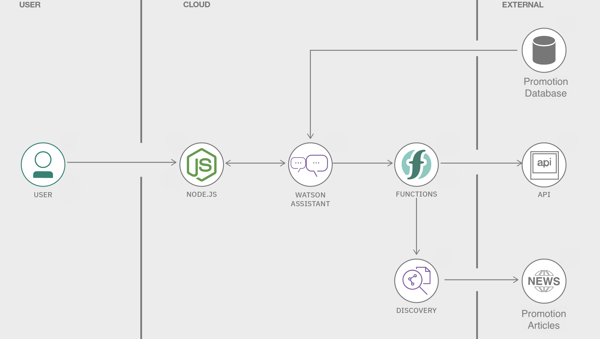
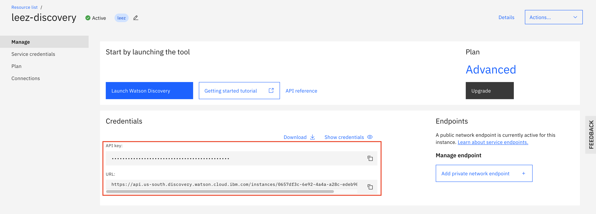
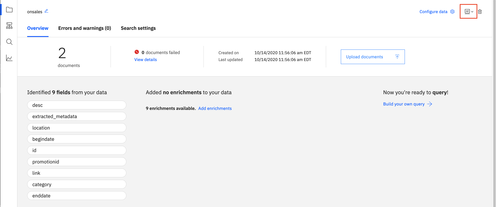
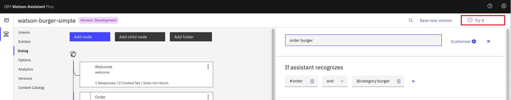
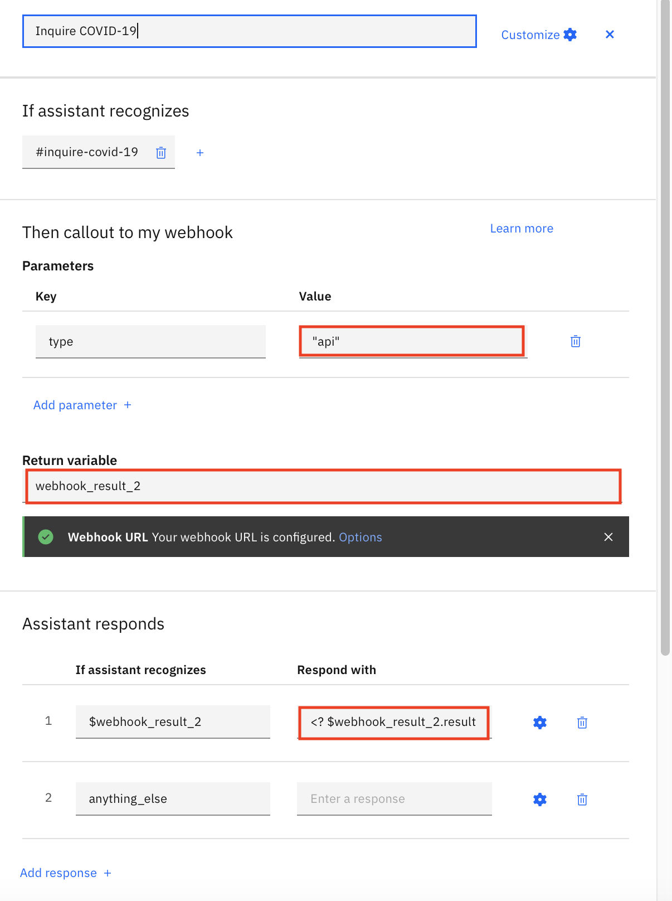
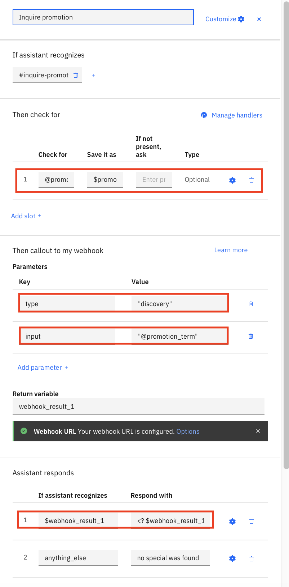

# Watson Chatbot Webhook - Know what is on sales before ordering

In this tutorial, you are going to enhence the [Basic Burger Ordering Chatbot with Watson Assistant Service](https://github.com/lee-zhg/watson-chatbot-simple.git). You'll configure the chatbot to provide promotion information. 

Because the promotion information is very dynamic and changes frequently over time, it may not be practical to embed it as part of the chatbot. Promotion information can be stored externally, such as in a database or Watson Discovery. In this repo, you are going to enhence the chatbot to retrieve and communicate the promotion information stored in a DB2 database and/or Watson Discovery service.



This repo is part of Watson chatbot serial. The entire serial includes
* [Simple ChatBot](https://github.com/lee-zhg/watson-chatbot-simple.git)
* [Dressed-up ChatBot](https://github.com/lee-zhg/watson-chatbot-advanced.git)
* [Voice-Enabled ChatBot](https://github.com/lee-zhg/watson-voice-enabled-chatbot.git)
* [VoiceBot – Call and speak to ChatBot](https://github.com/lee-zhg/watson-voicebot.git) 

> **NOTE**: Watson Assistant service is available in IBM Cloud as well as part of IBM Cloud pak for Data. As the result, you can deploy and run your chatbot in public cloud, private cloud, hybird cloud and on-prem.

> Click [here](https://www.ibm.com/products/cloud-pak-for-data) for more information about IBM Cloud Pak for Data.

Adopted from IBM code pattern [Build a database-driven Slackbot](https://github.com/IBM-Cloud/slack-chatbot-database-watson) and [COVID Crisis Communications Starter Kit](https://github.com/lee-zhg/Solution-Starter-Kit-Communication-2020).


## Use Case Flow

1. User sends messages to the application (running locally or on IBM Cloud).
2. The application sends the user message to IBM Watson Assistant service, and displays the ongoing chat in a web page.
3. Watson Assistant uses the NLU and NLP to understand and fulfill your order, and sends requests for additional information back to the running application. Watson Assistant can be provisioned on either IBM Cloud or IBM Cloud Pak for Data.
4. Watson Assistant useds `web hook` to retrieve sales information dynamically from external sources such as DB2 database and Watson Discovery service.


## Included Components

* [IBM Watson Assistant](https://www.ibm.com/cloud/watson-assistant/): Build, test and deploy a bot or virtual agent across mobile devices, messaging platforms, or even on a physical robot.
* [IBM Watson DB2](https://cloud.ibm.com/catalog/services/db2): A fully managed, high-performant relational data store running the enterprise-class DB2 database engine.
* [IBM Watson Disacovery](https://cloud.ibm.com/catalog/services/discovery): Add a cognitive search and content analytics engine to applications.


## Exercise Flow

### Step 1 - Clone the repo

To clone `watson-chatbot-webhook` locally in a terminal, run:

```
$ git clone https://github.com/lee-zhg/watson-chatbot-webhook.git

$ cd watson-chatbot-webhook
```

We’ll be using the file [`data/skill-watson-burger-simple.json`](data/skill-watson-burger-advanced.json) to upload the Assistant Intents, Entities, and Dialog Nodes.


### Step 2 - Create Watson Assistant Service

If you have completed the exercise of [Basic Burger Ordering Chatbot with Watson Assistant Service](https://github.com/lee-zhg/watson-chatbot-simple.git), you should have created a `Watson Assistant` service instance in IBM Cloud. You may re-use the sample instance for the exercise in this repo.

In case you don't have a `Watson Assistant` service instance in IBM Cloud, create one and name it `burger-asssistant-service`:

* [**Watson Assistant**](https://cloud.ibm.com/catalog/services/conversation)


### Step 3 - Create Watson Discovery Service

If you don't have a `Watson Discovery` service instance in IBM Cloud, create one and name it `burger-discovery-service`:

* [**Watson Discovery**](https://cloud.ibm.com/catalog/services/discovery)

Take notes of 
   * API key
   * URL




### Step 4 - Configure Watson Discovery Service

To configure Watson Discover service,

1. Select `Launch Watson Discovery` button from your instance of Watson Discovery service.

1. Select `Upload your own data` link.

1. Select a plan if prompted.

1. Give a unique `collection name`, for example, "onsales". And `Create`.

1. Click `select documents` link.

1. Select `data/promotion001.json` and `data/promotion002.json` files in the cloned repository folder. Then, `Open`.

   

1. Click `View API detail`.

1. Take note of information
   - Collection ID
   - Configuration ID
   - Environment ID

1. Select `Build quries` link in the left pane.

1. Select `Search for documents` link to extend.

1. To verify the configuration and file loading, enter `half price` under `Use natural language`.

1. `Run query`.


### Step 4 - Create DB2 Service Instance - Under Construction

1. Login to IBM Cloud in the terminal environment.

   ```
   ibmcloud login 
   ```

   or

   ```
   ibmcloud login --sso
   ```

1. List your available resource groups.

   ```
   ibmcloud resource groups
   ```

1. Target the resource group where the `Cloud Function` will be configured.

   ```sh
   ibmcloud target -g RESOURCE_GROUP
   ```
   For example, top use the `default` resource group

   ```
   ibmcloud target -g default
   ```

1. Create a DB2 service instance in IBM Cloud of **us-south** region. And name it **promotionDB**.

   ```sh
   ibmcloud resource service-instance-create promotionDB dashdb-for-transactions free us-south
   ```
   {: pre}
   
   The `Lite(free)` plan is not available in all locations. Other plan is available.

1. To access the database service from Cloud Functions later on, you need the authorization. Thus, you create service credentials and label them **promotion**.

   ```sh
   ibmcloud resource service-key-create promotion Manager --instance-name promotionDB
   ```


### Step 5 - Configure Cloud Functions

IBM Cloud Functions is a distributed compute service that executes application logic in response to requests from web or mobile apps. You can set up specific actions to occur based on HTTP-based API requests from web apps or mobile apps, and from event-based requests from services like Cloudant. Functions can run your code snippets on demand or automatically in response to events.

With IBM Cloud™ Functions, you can use your favorite programming language to write lightweight code that runs app logic in a scalable way. The Function-as-a-Service (FaaS) programming platform is based on the open source project Apache OpenWhisk.

In this section, you are going to register actions for Cloud Functions and bind service credentials to those actions. The Cloud Functions will be triigered by the Watson chatbot and search for on-sales information stored in DB2 database of IBM Cloud and Watson Discovery service. 

Because the Cloud Functions is not the focus of the repo, scripts are provided to automate the Cloud Functions configuration. In addition to be used by the Watson chatbot webhook, the Cloud Functions is also configured for the environment preparation.

To perform the registration and setup, run the command below and this will execute the **setup_cloudfunctions.sh** script. If your system does not support shell commands, copy each line out of the file **setup_cloudfunctions.sh** and execute it individually.

1. Update file `controller_parameters.json`.

1. Configure Cloud Function

   ```sh
   ./setup_cloudfunctions.sh  YOURSECRET
   ```

1.  Obtain the URI for the deployed **controller** action.

   ```sh
   ibmcloud fn action get chatbot-promotion-pkg/controller --url
   ```

   Keep this information available for the next section.


### Step 6 - Configure Webhook for Watson Assistant Service

To configure the Watson Assistant webhook,

1. Login to [IBM Cloud](https://cloud.ibm.com).

1. On the dashboard, find and open your `Watson Assistant` service instance.

1. Click `Launch Watson Assistant` on the `Manage` tab.

1. Select the `Skills` tab in the left navigation tab.

1. Select the `watson-burger-simple` skill.

1. Select `Options` menu in the left pane.

1. Select `Webhooks` option.

1. In `URL` field, enter the url value returned by the command `ibmcloud fn action get chatbot-promotion-pkg/controller --url` in the previous section. Make sure to add a .json at the end of the URL to indicate that JSON data should be returned. The change is automatically saved when you tab out the field.

   >**Note**: Make sure to add a .json at the end of the URL to indicate that JSON data should be returned. 

1. Click `Add header` link.

1. Enter `X-Require-Whisk-Auth` in the `Header name` field.

1. Enter your `YOURSECRET` which you used when create the cloud function.


### Step 7 - Try it

`Try it` feature provides a quick testing option while you develop a skill.



To test the chatbot via `try it` link,

1. Login to [IBM Cloud](https://cloud.ibm.com).

1. On the dashboard, find and open your `Watson Assistant` service instance.

1. Click `Launch Watson Assistant` on the `Manage` tab.

1. Select the `Skills` tab in the left navigation tab.

1. Select `watson-burger-simple` tile to open it.

1. Click `Try it` link.

1. "Try it out` window open on the right. You should be familar to the chatbot UI now.

#### 7.1 - Inquire Covid-19 information

1. Inquire the latest Covid-19 information by entering `latest covid-19 data`.

1. The `Inquire COVID-19` node understands the `intent` and trigger a Cloud Functions action running in IBM Cloud. 

   

   * Watson chatbot passes `api` as the parameter `type`, so the cloud function action makes a API call to inquire the latest data of COVID-19.
   * Contents returned by the cloud function is stored in `webhook_result_2` variable.
   * The node is configured to display `<? $webhook_result_2.result ?>` as the chatbot response.

1. After the chatbot communicates with the cloud function, it replies to the inquiry with a message similar to

   ```
   Total Cases: 38911224
   Total Deaths: 1098181
   Total Recovered: 26879578
   Source: Johns Hopkins CSSE
   ```

#### 7.2 - Inquire Promotion Information Stored in Waston Discovery Service

1. Make a promotion inquiry by entering `any special`.

1. The `Inquire promotion` node understands the `intent` and trigger the same Cloud Functions action running in IBM Cloud. 

   

   * Watson chatbot passes `discovery` as the parameter `type`, so the cloud function action makes a API call to Watson Discovery service which returns special promotion information.
   * The node has an optional slot. If the promotional item or term information is identified, it'll be stored in entity `@promotion_term`. Because this is an optional slot, when no promotional item or term is identified, end user won't be prompted for. In this example, `@promotion_term` contains no information as it's a general promotion inquiry. 
   * Contents returned by the cloud function is stored in `webhook_result_1` variable.
   * The node is configured to display `<? $webhook_result_1.result ?>` as the chatbot response.
   * To identify what JSON elements are available in the return object, `<? $webhook_result_1 ?>` can be tested at development phase.

1. After the chatbot communicates with the cloud function, it replies to the inquiry with a message similar to

   ```
   Here are available specials: 

   Promotion: Free small drink with purchase of any meal,
   Promotion Location: US,
   Start Date: 2020-10-01 00:00:00
   End Date: 2020-12-31 23:59:00
   Coupon Link: https://www.ibm.com/events/think/ 

   Promotion: Buy one hamburger and get 1/2 price for the 2nd hamburger,
   Promotion Location: Dallas,
   Start Date: 2020-06-01 00:00:00
   End Date: 2021-12-31 23:59:00
   Coupon Link: https://www.ibm.com 
   ```

#### 7.3 - Inquire Hamburger Promotion Information Stored in Waston Discovery Service

1. Make a promotion inquiry by entering `any special for ordering hamburger`.

1. This time, the Watson assistant has two understanding
   * `inquire_promotion` as the `intent`
   * `hamburger` in the entity `@promotion_term`

1. Since the content in the entity `@promotion_term` is used in the cloud function when making inquires to Watson Discovery service, this time the chatbot only returns the `hamburger` related promotion.

   ```
   Here are available specials: 

   Promotion: Buy one hamburger and get 1/2 price for the 2nd hamburger,
   Promotion Location: Dallas,
   Start Date: 2020-06-01 00:00:00
   End Date: 2021-12-31 23:59:00
   Coupon Link: https://www.ibm.com 
   ```

1. Configuration of the `Inquire promotion` node demonstrates 
   * how to collect inquiry term via the chatbot and pass it to cloud function as parameter
   * how to build chatbot response based on contents returned by the webhook


## License

This code pattern is licensed under the Apache Software License, Version 2.  Separate third party code objects invoked within this code pattern are licensed by their respective providers pursuant to their own separate licenses. Contributions are subject to the [Developer Certificate of Origin, Version 1.1 (DCO)](https://developercertificate.org/) and the [Apache Software License, Version 2](https://www.apache.org/licenses/LICENSE-2.0.txt).

[Apache Software License (ASL) FAQ](https://www.apache.org/foundation/license-faq.html#WhatDoesItMEAN)

## Links

* [Demo on youtube](https://youtu.be/6QlAnqSiWvo)
* [IBM Watson Assistant Docs](https://cloud.ibm.com/docs/services/conversation/dialog-build.html#dialog-build)
* [Blog for IBM Watson Assistant Slots Code Pattern](https://developer.ibm.com/code/2017/09/19/managing-resources-efficiently-watson-conversation-slots/)

## Learn more

* **Artificial Intelligence Code Patterns**: Enjoyed this Code Pattern? Check out our other [AI Code Patterns](https://developer.ibm.com/technologies/artificial-intelligence/).
* **AI and Data Code Pattern Playlist**: Bookmark our [playlist](https://www.youtube.com/playlist?list=PLzUbsvIyrNfknNewObx5N7uGZ5FKH0Fde) with all of our Code Pattern videos
* **With Watson**: Want to take your Watson app to the next level? Looking to utilize Watson Brand assets? [Join the With Watson program](https://www.ibm.com/watson/with-watson/) to leverage exclusive brand, marketing, and tech resources to amplify and accelerate your Watson embedded commercial solution.
* **Kubernetes on IBM Cloud**: Deliver your apps with the combined the power of [Kubernetes and Docker on IBM Cloud](https://www.ibm.com/cloud/container-service)


